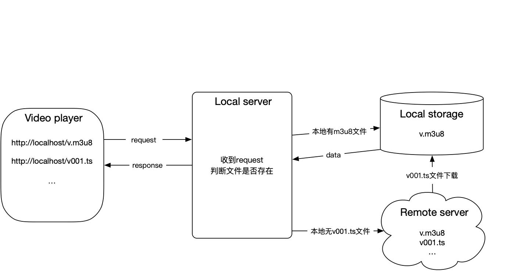

## M3U8视频边下边播示例

视频播放逻辑：

 
三方库依赖：
```
  pod 'GCDWebServer'
  pod 'CocoaHTTPServer'
  pod 'ZFPlayer', '~> 4.0'
  pod 'ZFPlayer/ControlView', '~> 4.0'
  pod 'ZFPlayer/AVPlayer', '~> 4.0'
```

注意事项：使用`CocoaHTTPServer`，需要添加设置选项`GCC_PREPROCESSOR_DEFINITIONS`
```
DD_LEGACY_MACROS=1
```
使用`GCDWebServer`，需要先添加`addHandler`，再启动`startWithPort`，否则会崩溃
